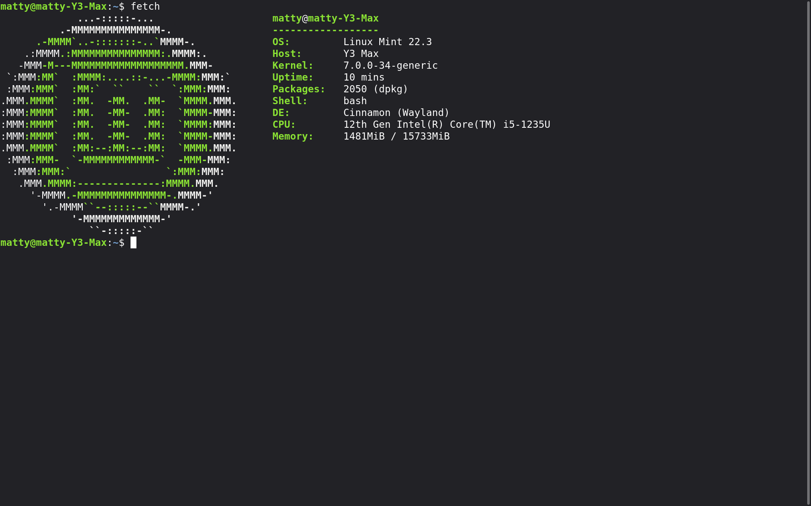

# mint_fetch

Fast `neofetch` alternative in Rust. Supports all 200+ distros from upstream neofetch, reads system info directly from `/proc`, `/sys`, `/etc` — no external processes.

## Speed

Measured on Linux Mint 22.3, Intel i5-1235U:

```
$ time fetch
real    0m0.008s

$ time neofetch
real    0m0.487s
```

## Install

```bash
git clone https://github.com/Mat4ikDD-glitch/mint_fetch.git
cd mint_fetch
cargo build --release
sudo cp target/release/mint_fetch /usr/local/bin/fetch
fetch
```

## Structure

```
mint_fetch/
├── Cargo.toml
├── src/
│   ├── main.rs              # binary
│   ├── ascii_data.rs        # generated — do not edit
│   ├── neofetch_source.sh   # upstream neofetch source
│   └── bin/
│       └── gen_ascii.rs     # generator
```

## How it works

- `gen_ascii.rs` reads `neofetch_source.sh` and generates `ascii_data.rs` with:
  ```rust
  pub fn get_ascii(name: &str) -> Option<(&'static str, [u8; 6])>
  ```
  Arms are sorted by key length descending, so specific patterns (`linux mint`) come before general ones (`linux`).
- `main.rs` reads `/etc/os-release`, `/proc/*`, `/sys/*`, looks up the art, replaces `${c1}`…`${c6}` with ANSI codes, prints art left + info right.

## Regenerate art

```bash
cargo run --bin gen_ascii --release
cargo build --release
```

## License

MIT. ASCII art from [neofetch](https://github.com/dylanaraps/neofetch) (MIT, © Dylan Araps).
